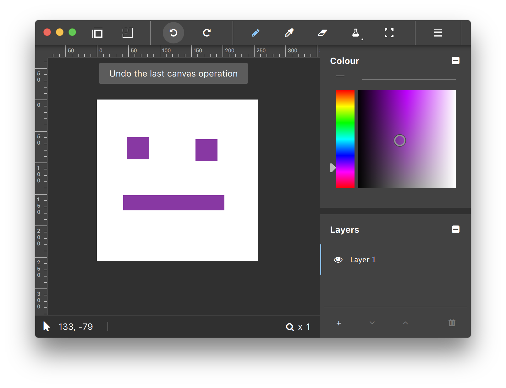
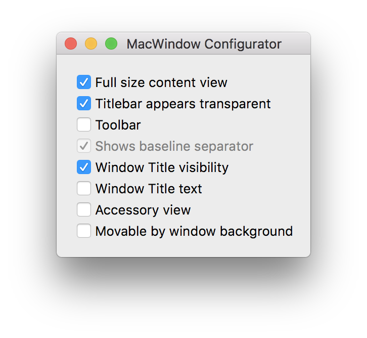
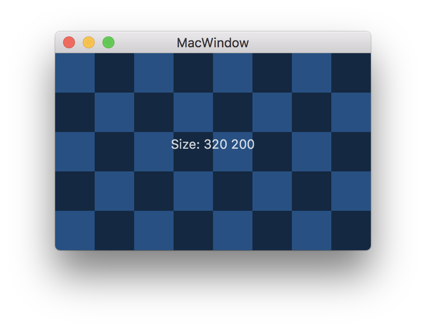
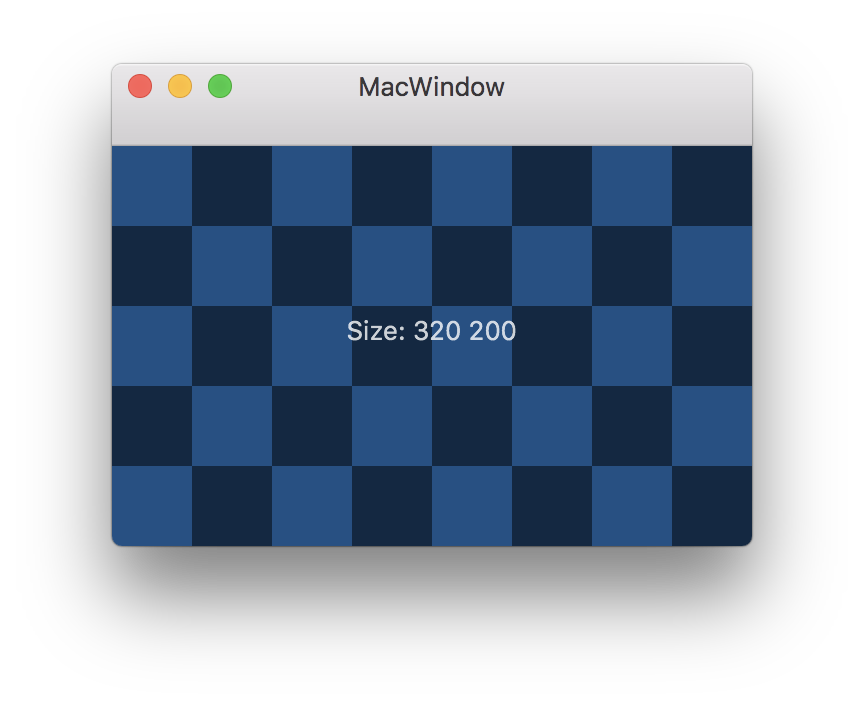
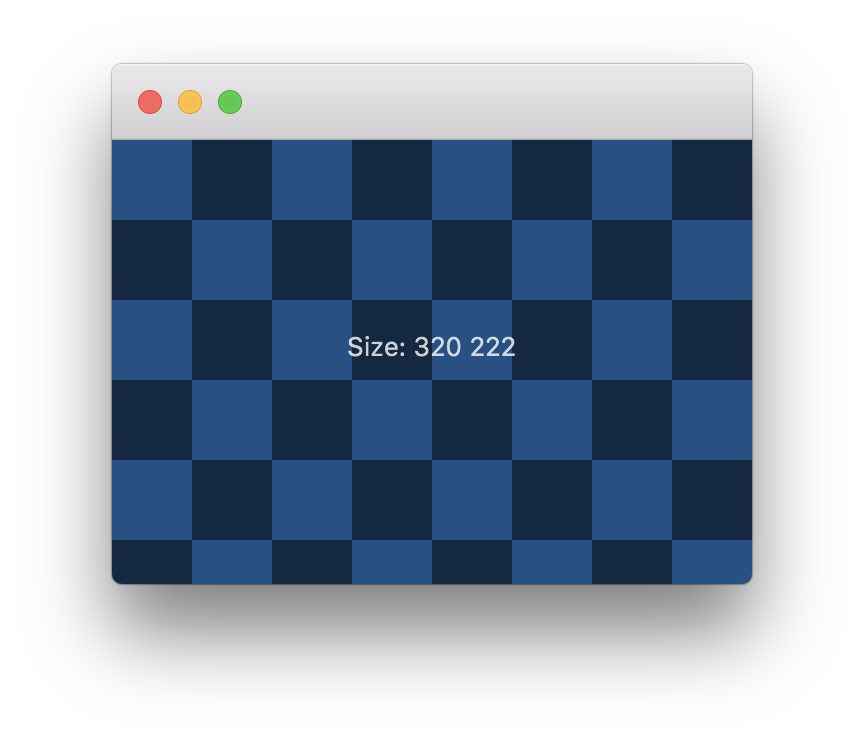
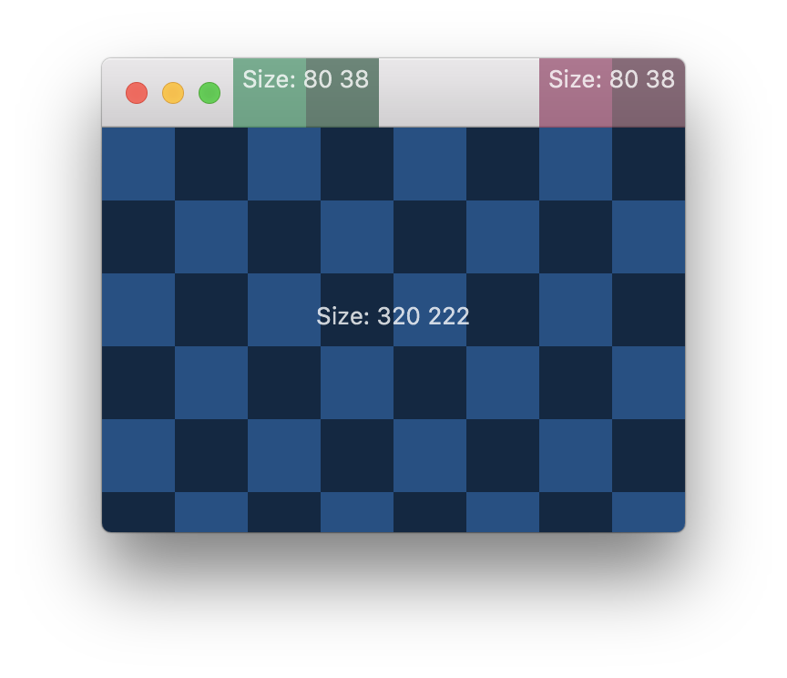
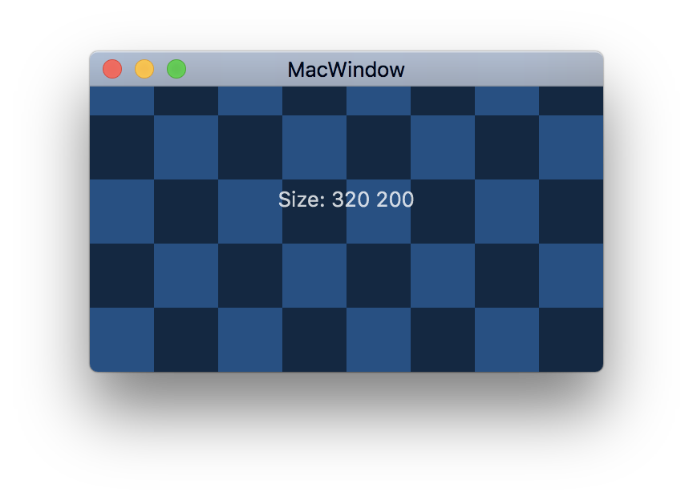
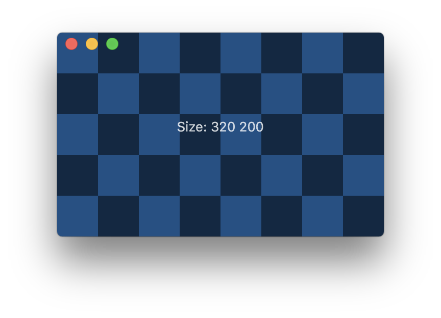
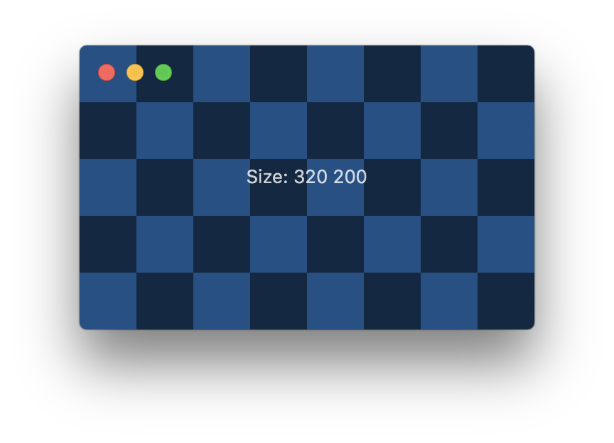

NSWindow Configuration for Qt Application Developers
====================================================
macOS application windows have several different modern configurations
which go beyond the standard "thin" titlebar look. However, using the
NSWindow API to achive the desired configuration can be non-straightforward.

_Above_: the _Slate_ application with a unified title and toolbar look.

NSWindow configuration options are platform specific and are typically not available
through the cross-platform QWindow or QWidget API. Instead we'll create the native
and configure the NSWindow separately, and then embed the QWindow in it.

    nswindow.contentView = (__bridge NSView *)reinterpret_cast<void *>(qwindow->winId());

_Sidebar: Top-level windows on macOS are NSWindow instances. NSWindow content is
provided by the content view, which is a NSView. QWindows are 
NSViews on macOS and QWindow::WId is a NSView pointer._

This project provides an incomplete C++ API for NSWindow: MacWindow.

    QWindow *applicationWindiow = ...
    MacWindow macWindow;
    macWindow.setContentView(applicationWindow)
    macWindow.setFullSizeContentView(true);
    macWindow.show()

And also a configurator panel for exploring the NSWindow configurations.

The NSWindow Tech Tree
----------------------
Okay, this is more like a tech shrubbery with intertwined options.

- NSWindow.Toolbar
- NSWindow.titleVisibility
  - NSWindow.title
- NSFullSizeContentViewWindowMask
  - NSWidnow.titlebarAppearsTransparent
  - (with Toolbar) NSToolBar.showsBaselineSeparator
- [NSWindow addTitlebarAccessoryViewController]

Catalog of NSWindow Configuratons
---------------------------------
Let's break out the checkerboard test QWindow to illustrate which parts
of the NSWindow the Qt application QWindow is drawing to.

_Standard_ - The standard window configration with a "thin" titlebar.

_Set toolbar_ - Adding a Toolbar expands the titlebar. The Toolbar can be populated
with native toolbar items, perhaps using QMacToolBar.

_Clear titleVisibility_ - Disabling title visiblity vertically centers the traffic lights.
Note that this option is distinct from merely setting an empty title string.

_Add addTitlebarAccessoryViewController_  - Accessory NSViews/QWindows can be added to the title/toolbar area.
The application controls view width, while the height is set automatically.
The left accessory view (green) is anchored to the traffic lights, while the
right view (red) is anchored to the window edge.

_Set fullSizeContentView_ - Going back to the thin titlebar: Setting full size content view
makes the content view/QWindow cover the entire NSWindow area. The title
bar will be rendred with a nice blur effect.

_Set titlebarAppearsTransparent_ - Make the titlebar transparent. We've set an empty title text string as well.

_Set toolbar, clear titleVisibility_ - Adding a Toolbar without a window title lowers the traffic lights again.
You also want to clear _showsBaselineSeparator_ to prevent the toolbar from
drawing a separator line which would, if present, make the application completely
unusable.

